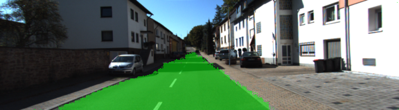
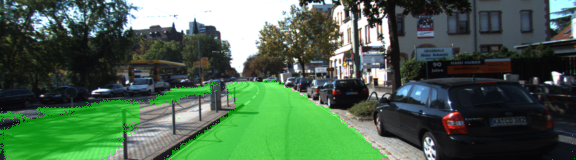
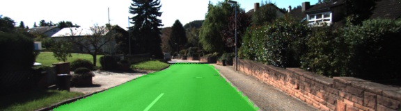

# UDACITY SELF-DRIVING CAR ENGINEER NANODEGREE
# Semantic Segmentation Project (Advanced Deep Learning)


## Introduction

In this project, the goal is to label the pixels of a road in images using a Fully Convolutional Network (FCN) based on the VGG-16 image classifier architecture.  Using images from a car dash camera, we perform semantic segmentation to identify the area of scene which represent "drivable" roads vs "non-drivable" areas (not-roads).


## Approach

##  Semantic Segmentation

Here are the steps I took to build the Fully Convolutional Network:
1.  Build the Fully Convolutional Network
2.  Load the pretrained vgg model
3.  Learn the correct features from the images.
4.  Implement function layers
5.  Optimize the neural network
6.  Train the neural network
7.  Print loss of the network while the network is training.

### Architecture


First, we convert a pre-trained VGG-16 network to a fully convolutional network.
We replace the final fully connected layer to a 1x1 convolution.
Next we set the depth equal to number of desired classes = 2 (road and not-road). 

We add skip connections and 1x1 convolutions on previous VGG layers (layers 3 and 4).
Then we upsample using transposed convolution. (Upsample 1x1-convolved layer 7 then add to the 1x1-convolved layer 4). 

We use a kernel initializer and regularizer on each convolution and transpose convolution layer.


Here are some additional details about the Fully Convolution Networks:
Structurally an FCN is usually comprised of two parts:  encoder and decoder
The encoder is a series of convolutional layers like VGG and ResNet.
The goal of the encoder is to extract features from the image.
The decoder up-scales the output of the encoder such that it's the same
size as the original image.  This results in segmentation or prediction
of each individual pixel in the original image.

1.  Replace fully connected layers with 1x1 convolutional layers
When you use a 1x1 convolution, the output tensor will remain 4D instead of flattening to 2D
so spatial information will be preserved.

2.  Upsampling through use of transposed convolutional layers
Tranposed convolution is essentially a reverse convolution in which the
forward and backward passes are swapped.
Also, known as deconvolution because it undoes previous convolution.

3.  Skip connections
Skip connections allow network to use information from multiple resolution scales.
As a result the network is able to make more precise segmentation decisions

Skip connections are way of retaining information that would be normally be lost in CNNs.
The way that skip connections work is by connecting the output of one layer to
a non-adjacent layer.

## Notes
The link for the frozen VGG16 model is hardcoded into helper.py. 
The model is not vanilla VGG16, but a fully convolutional version, which already contains the 1x1 convolutions to replace the fully connected layers. 
The original FCN-8s was trained in stages. The authors later uploaded a version that was trained all at once to their GitHub repo. The version in the GitHub repo has one important difference: The outputs of pooling layers 3 and 4 are scaled before they are fed into the 1x1 convolutions. As a result, some students have found that the model learns much better with the scaling layers included. The model may not converge substantially faster, but may reach a higher IoU and accuracy.
When adding l2-regularization, setting a regularizer in the arguments of the tf.layers is not enough. Regularization loss terms must be manually added to your loss function. otherwise regularization is not implemented.

### Dataset
1.  Download Kitti Road dataset. 
2.  Extract the dataset in the data folder. 
This will create the folder data_road with all the training and test images.

### Implementation

I implemented the code in the main.py module indicated by the comments with "TODO" tags. 
The comments indicated with "OPTIONAL" tag are not required to complete.


### Run
Run the following command to run the project:
python main.py


## Neural Network Training

Here is how I trained the model.


### Optimizer

The loss function for the network is cross-entropy, and an Adam optimizer is used.

### Training

The hyperparameters used for training are:

  - keep_prob: 0.8
  - learning_rate: 0.0001
  - epochs: 12
  - batch_size: 8

## Results
Over time, the model decreases loss.

Loss per batch tends to average 0.105 after 5 epochs 
and around 0.052 after 12 epochs. 
4.  Does the project correctly label the road?
5.  The project labels most pixels of roads close to the best solution. The model doesn't have to predict correctly all the images, just most of them.
6.  A solution that is close to best would label at least 80% of the road and label no more than 20% of non-road pixels as road.

### Samples
The overall results are good, however, there are certain images where the segmantic segmentation is spotty.

Below are a few sample images from the output of the fully convolutional network, with the segmentation class overlaid upon the original image in green.






---

## *The following is from the original Udacity repository README*

### Introduction
In this project, you'll label the pixels of a road in images using a Fully Convolutional Network (FCN).

### Setup
##### Frameworks and Packages
Make sure you have the following is installed:
 - [Python 3](https://www.python.org/)
 - [TensorFlow](https://www.tensorflow.org/)
 - [NumPy](http://www.numpy.org/)
 - [SciPy](https://www.scipy.org/)
##### Dataset
Download the [Kitti Road dataset](http://www.cvlibs.net/datasets/kitti/eval_road.php) from [here](http://www.cvlibs.net/download.php?file=data_road.zip).  Extract the dataset in the `data` folder.  This will create the folder `data_road` with all the training a test images.

### Start
##### Implement
Implement the code in the `main.py` module indicated by the "TODO" comments.
The comments indicated with "OPTIONAL" tag are not required to complete.
##### Run
Run the following command to run the project:
```
python main.py
```
**Note** If running this in Jupyter Notebook system messages, such as those regarding test status, may appear in the terminal rather than the notebook.

### Submission
1. Ensure you've passed all the unit tests.
2. Ensure you pass all points on [the rubric](https://review.udacity.com/#!/rubrics/989/view).
3. Submit the following in a zip file.
 - `helper.py`
 - `main.py`
 - `project_tests.py`
 - Newest inference images from `runs` folder
 
 ## How to write a README
A well written README file can enhance your project and portfolio.  Develop your abilities to create professional README files by completing [this free course](https://www.udacity.com/course/writing-readmes--ud777).
